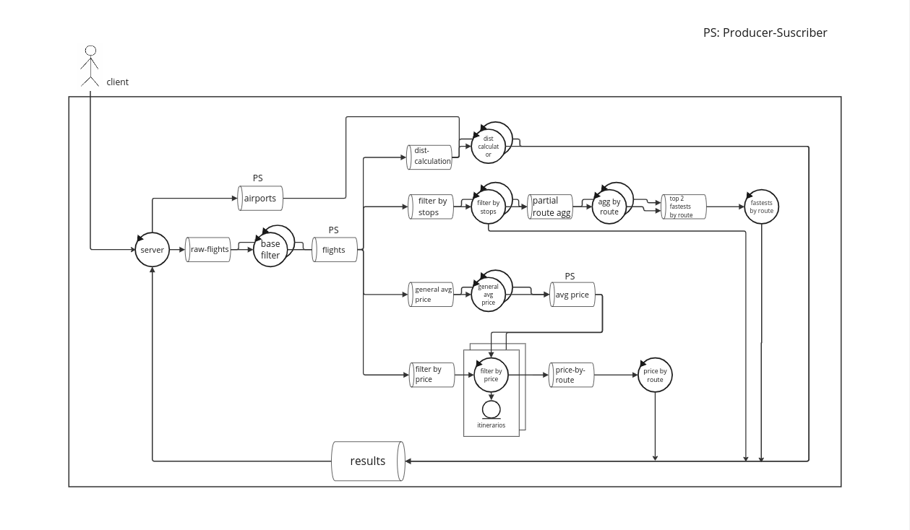

# TP1 de Sistemas Distribuidos I

Integrantes:

| Nombre y Apellido | Padron |
|:-----|:---:|
| Taiel Colavecchia | 102510 |
| Lucia Kasman | 97112 |

# Indice

Indice:
- [TP1 de Sistemas Distribuidos I](#tp1-de-sistemas-distribuidos-i)
- [Indice](#indice)
- [Documentación técnica](#documentación-técnica)
  - [Introducción](#introducción)
  - [Desarrollo](#desarrollo)
  - [DAG de la solución](#dag-de-la-solución)
  - [Vistas](#vistas)
    - [Física](#física)
      - [Despliegue](#despliegue)
      - [Robustez](#robustez)
    - [Procesos](#procesos)
      - [Actividad](#actividad)
      - [Secuencia](#secuencia)
    - [Desarrollo](#desarrollo)
      - [Paquetes](#paquetes)

# Documentación técnica

## Introducción

En este proyecto se busca crear un sistema distribuido que analice 6 meses de registros de precios de  vuelos de avión p/proponer mejoras en la oferta a clientes.

Los registros poseen trayectos (aeropuertos origen-destino), tarifa total,  distancia total, duración, cada segmento con escalas y aerolíneas.

Utilizando una arquitectura cliente-servidor, los registros se deben leer en el cliente, recibir en el servidor y procesar en diversos workers de manera que los mismos se puedan replicar y el sistema sea escalable. Además, se deben utilizar los middleware correspondientes para minimizar la pérdida de datos.

Se busca procesar las siguientes queries:

* ID, trayecto, precio y escalas de vuelos de 3 escalas o más.
* ID, trayecto y distancia total de vuelos cuya distancia total sea mayor a 
cuatro veces la distancia directa entre puntos origen-destino.
* ID, trayecto, escalas y duración de los 2 vuelos más rápidos para cada 
trayecto entre todos los vuelos de 3 escalas o más.
* El precio avg y max por trayecto de los vuelos con precio mayor a la 
media general de precios.

## Desarrollo

El proyecto posee un cliente, un servidor y ocho workers con capacidad de replicación, además de siete middlewares, tres de los cuales son de la forma Producer-Subscriber (PS) y el resto Producer-Consumer (PC). 

Para la creación de los middlewares se utilizó el software RabbitMQ, creando Exchanges para los de tipo PS y working queues para los de tipo PC. 

Para la comunicación entre cliente y servidor se utilizaron sockets a través del protocolo TCP, con un protocolo de mensajería que consiste en los registros separados por "\n" con cada valor dentro del registro separado por ";". Estos registros se envían de a batches, con un header y un body que consiste en el tamaño de cada batch seguido de los registros. El header es un string que denota el tipo de datos que se están enviando y cuando se terminan de enviar todos los datos se envía un "EOF" con un body de valor cero. 

Los batches luego pasan por los middlewares y se van repartiendo a los workers para completar las queries necesarias. Cuando se van obteniendo resultados se los agrega a un middleware de resultados, que va devolviendo los mismos al servidor y a su vez este los manda al cliente.

Cuando el servidor recibe un mensaje de EOF debe propagarlo por todo el sistema. Esto se logra por un sistema de reencolamiento de los EOF, donde cada worker sabe las cantidad de réplicas que están levantadas y cuando recibe del middleware de upstream un EOF, cuando el valor del body es menor al de las réplicas, le suma un 1 al valor del body y lo reencola en el upstream. Luego, cierra la conexión con el upstream. Cuando llega a la última réplica, esta propaga el mensaje de EOF al downstream y cierra su conexión. Si el downstream es el middleware de results, entonces le agrega al body el nombre de la query que el worker estuvo resolviendo.

Así, el servidor cuenta los EOF que recibe con un body que tiene el nombre de una query y cuando obtuvo las cuatro queries envía al cliente un mensaje de EOF y cierra la conexión.

## DAG de la solución

## Vistas

### Física

_[Volver al Indice](#indice)_

#### Despliegue

#### Robustez

### Procesos

_[Volver al Indice](#indice)_

#### Actividad

#### Secuencia

Cuando un mensaje de fin arriba a un filter replicado, se compara el valor que acompaña el EOF para conocer si es el máximo posible (cantidad de réplicas de ese worker). En caso de que no sea el máximo el mensaje se envía a un filtro del mismo tipo, si no se envía al downstream correspondiente.

### Desarrollo

_[Volver al Indice](#indice)_

#### Paquetes

